# Documentación práctica FTP

En este directorio se documenta paso a paso la práctica de configuración de un servidor FTP usando Vagrant y DNS.

## Instalación de las máquinas

Primero creamos dos VMs mediante el archivo Vagrantfile, la máquina del DNS se llamará 'ns' y la del FTP se llamará 'ftp'

## Arranque de las VMs

Después tendremos que crear y arrancar las VMs, para lo que usaremos los siguientes comándos en la terminal:

**vagrant up**
**vagrant ssh ns**
**vagrant ssh ftp**

## Configuración de DNS

Ahora en la VM 'ns' vamos a configurar el DNS mediante BIND:

**sudo apt update**
**sudo apt install bind9 bind9utils bind9-doc**

### Creación de las zonas

Tendremos que crear dos zonas, una directa y una inversa mediante el siguiente archivo:

**sudo nano /etc/bind/named.conf.local**

Tendremos que añadir las siguientes líneas en el archivo:

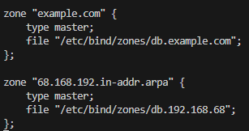

### Configuración de la zona directa

Ahora pasamos a configurar el archivo de la zona directa, cuyo archivo es:

**sudo nano /etc/bind/zones/db.example.com**

Añadiremos al archivo las siguientes líneas:

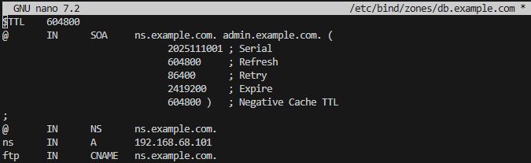

### Configuración de la zona inversa

Hay que configurar también el archivo de la zona inversa, cuyo archivo es:

**sudo nano /etc/bind/zones/db.192.168.68**

Añadiremos al archivo las siguientes líneas:

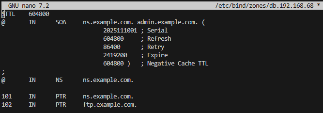

### Comprobaciones y reinicio

Una vez hecho esto, reiniciamos el servidor Bind con **sudo systemctl restart bind9** y después hacemos pruebas con:

**dig @192.168.68.101 ns.example.com**
**dig @192.168.68.101 ftp.example.com**
**dig @192.168.68.101 -x 192.168.68.101**
**dig @192.168.68.101 -x 192.168.68.102**

## Configuración de FTP

Instalamos en nuestro ordenador anfitrión un cliente FTP como puede ser Filezilla client en mi caso.

Luego creamos un directorio de pruebas y dentro añadimos un archivo .txt.

Nos conectamos desde el cliente FTP al servidor público ftp.cica.es con usuario anónimo y probamos a descargar el archivo 'check' de la carpeta 'pub'. Nos debe de dejar descargarla:

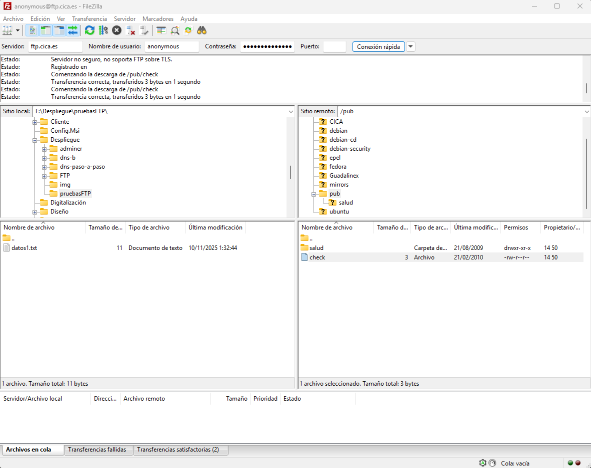

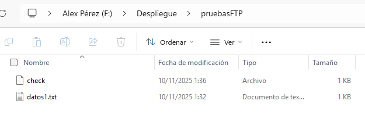

Ahora intentamos subir el archivo .txt que habíamos creado en la carpeta de pruebas.

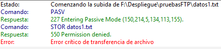

Como podemos ver no tenemos permiso para subir archivos, por lo que vamos a configurar el servidor vsftpd.

## Instalación y configuración del servidor vsftpd

Primero tendremos que instalar el paquete vsftpd en la VM

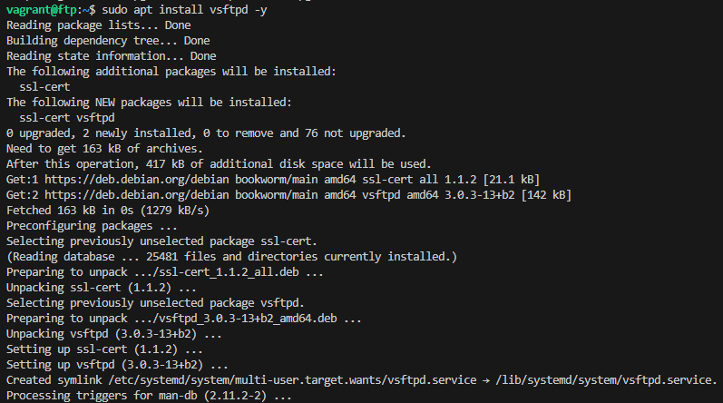

Comprobamos que se ha creado el usuario 'ftp' y que su directorio home es '/srv/ftp'

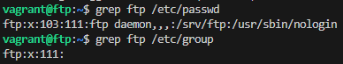

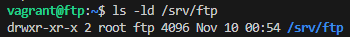

Ahora listaremos los usuarios que no pueden acceder al servicio FTP

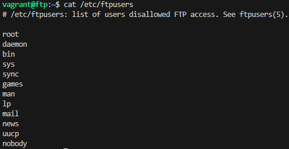

Vamos a ver si el servidor ftp está arrancado:

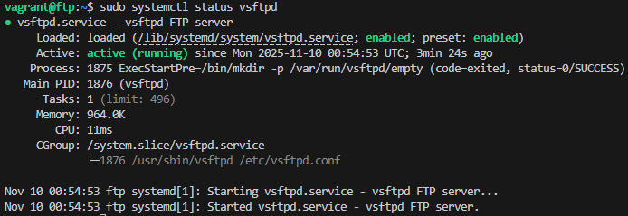

Tendremos que comprobar también si el servidor está escuchando por el puerto 21

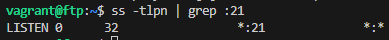

Vamos a hacer una copia de seguridad del archivo '/etc/vsftpd.conf'

Crearemos 3 usuarios:

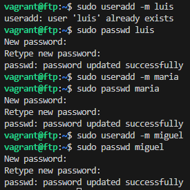

También vamos a crear unos ficheros de prueba para cada usuario:

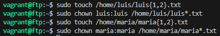

Ahora tendremos que configurar el archivo '/etc/vsftpd.conf' para asignar reglas y cumplir los objetivos que queremos:

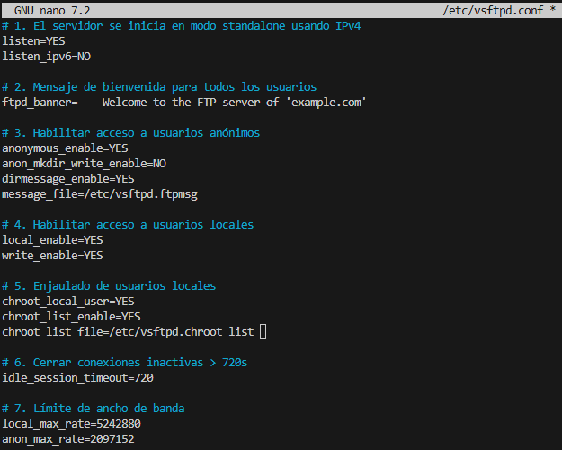

Para mostrar el mensaje a los usuarios anónimos tendremos que crear otro archivo llamado '/etc/vsftpd.ftpmsg' donde introduciremos el mensaje que queremos mostrar.

Para enjaular a un usuario en su directorio home, en mi caso voy a hacerlo con el usuario maria utilizaremos el archivo '/etc/vsftpd.chroot_list', donde introduciremos en él los usuarios que queramos enjaular.

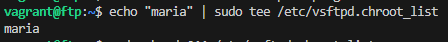

Ahora reiniciamos el servicio para que se apliquen los cambios y vemos si sigue escuchando por el puerto 21

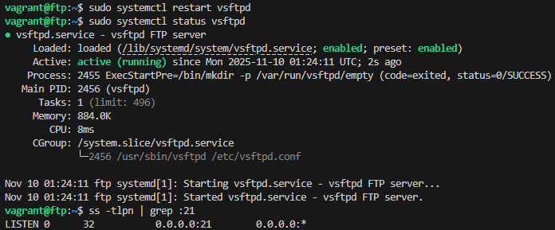

Vamos a probar a conectarnos desde el cliente FTP con usuario anónimo.

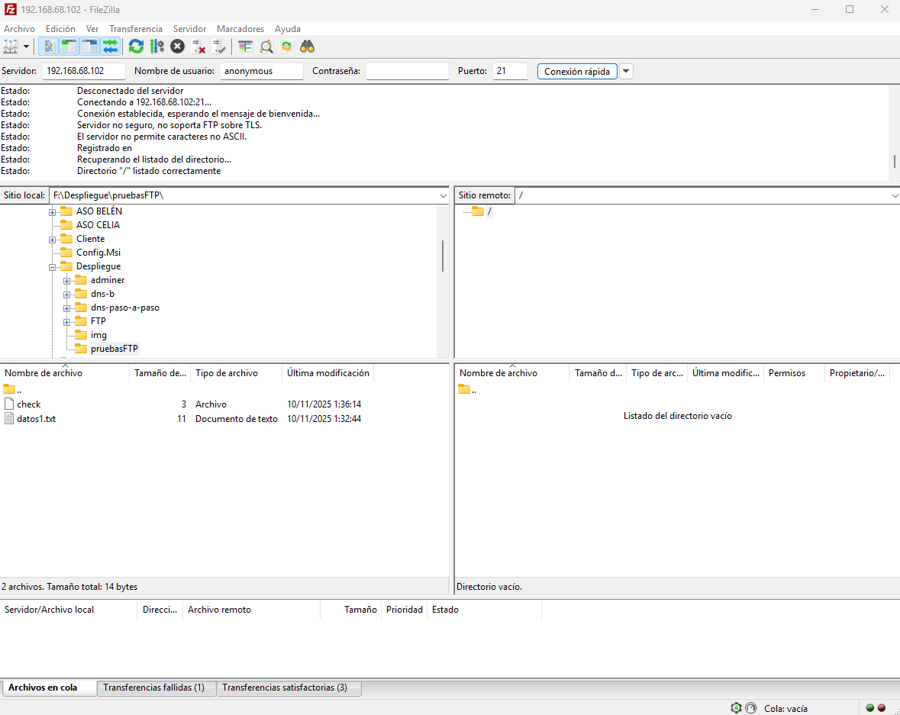

Ahora ya sí podemos acceder con usuario anónimo.

Vamos a comprobar que el usuario maria no está enjaulado en su home.

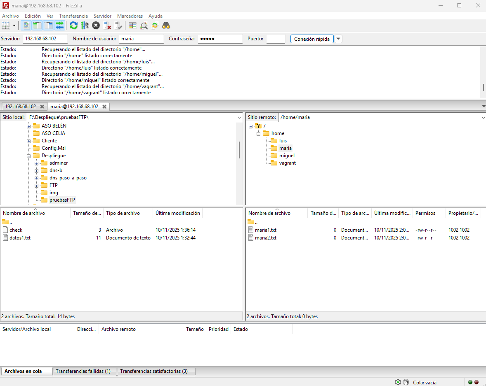

Como podemos observar puede viajar a través de todo el home.

Vamos a probar el usuario luis, que debería de no poder salir de su home.

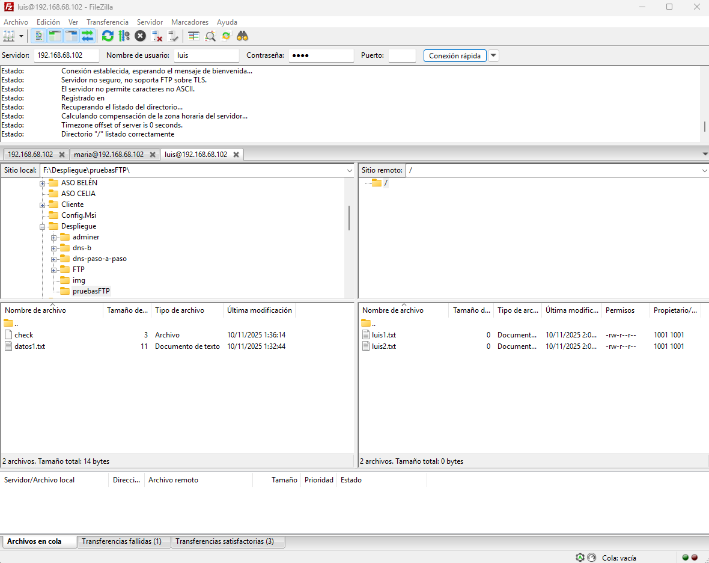

Como podemos observar no puede salir de su home.

## Configuración del servidor vsftpd seguro

Vamos a hacer que nuestro servidor sea seguro.

Para empezar vamos a crear una carpeta para almacenar nuestro certificado de seguridad del servidor.

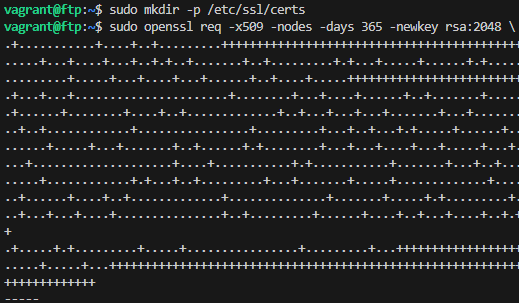

Vamos a configurar el archivo 'vsftpd.conf' para que los usuarios anónimos no puedan acceder a conexiones cifradas.

Reiniciamos el servicio y vemos si sigue escuchando por el puerto 21

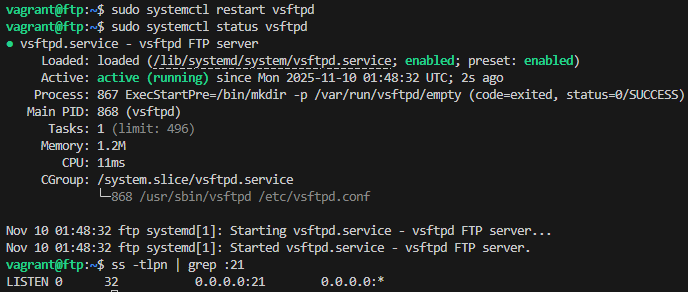

Ahora vamos a probar la conexión segura con el cliente FTP, creando una sesión segura para el usuario luis y además mostraremos el certificado que le aparece al usuario.

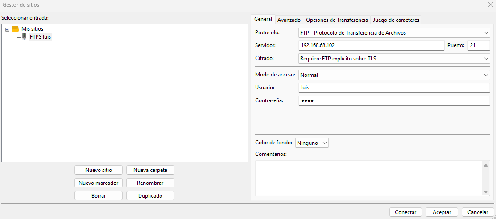

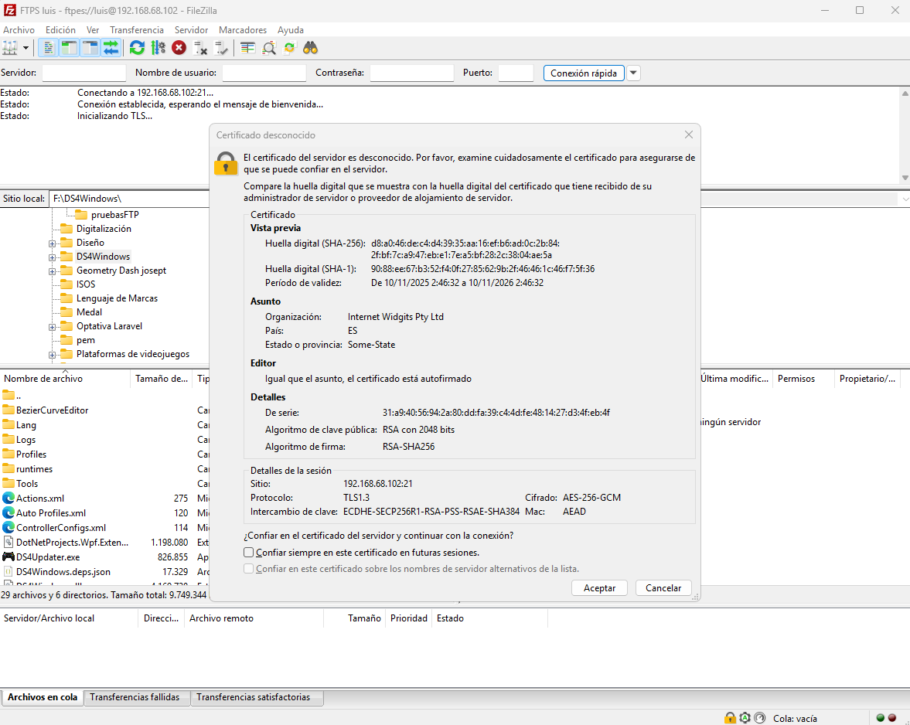

Vamos a probar a descargar algún archivo del servidor, y también podemos ver si la conexión es segura con un candado que aparece en la parte inferior del cliente.

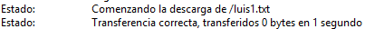

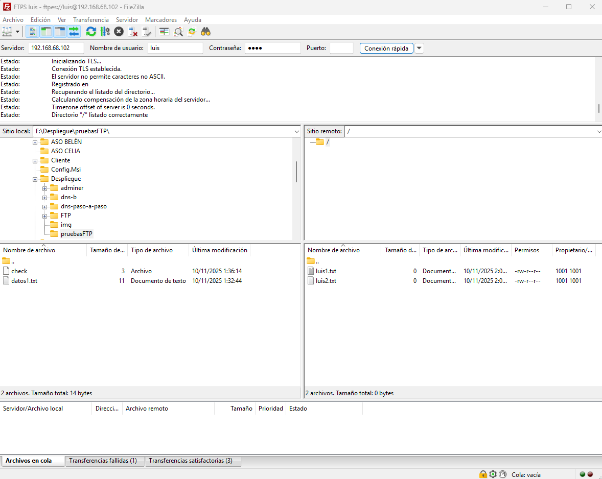

Vamos a intentar a realizar una conexión segura con un usuario anónimo.

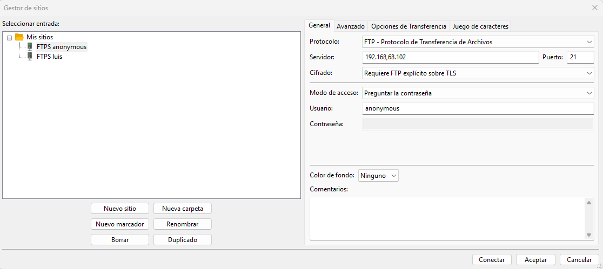

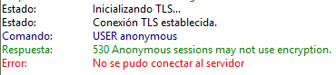

Como podemos comprobar, se rechaza la conexión con usuarios anónimos.

Si queremos realizar una conexión segura con algún usuario ya hemos visto como es con el usuario lui, pues lo mismo para los demás usuarios.